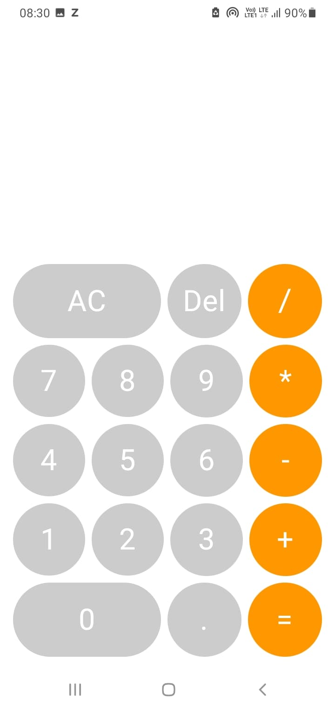
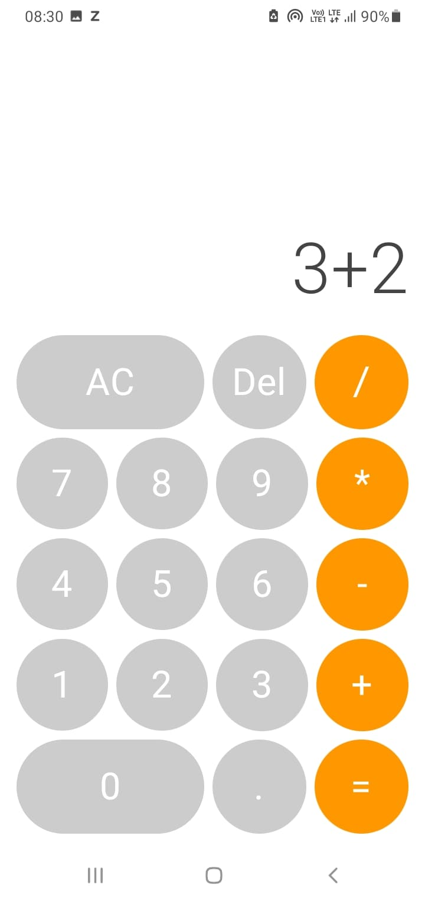
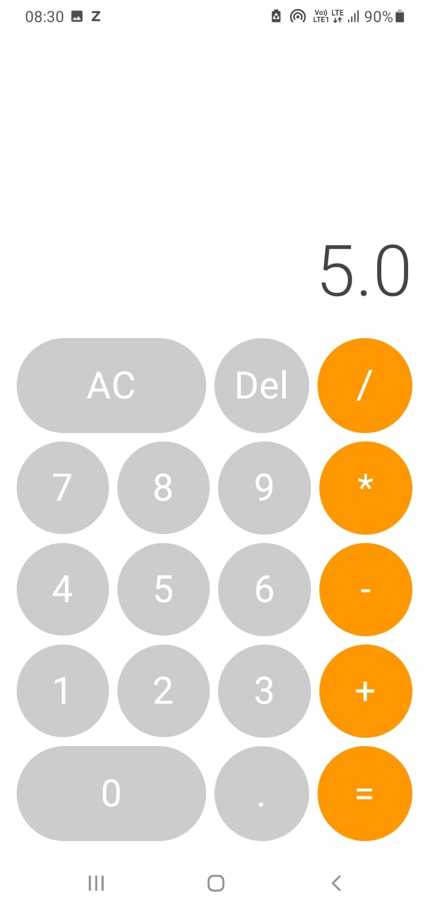
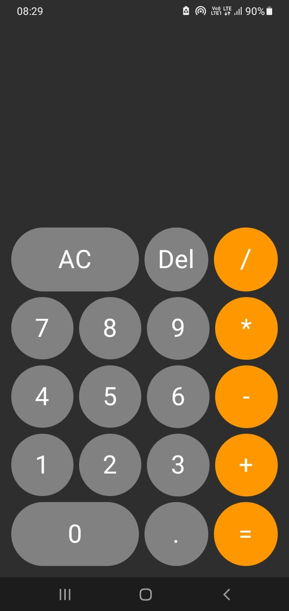
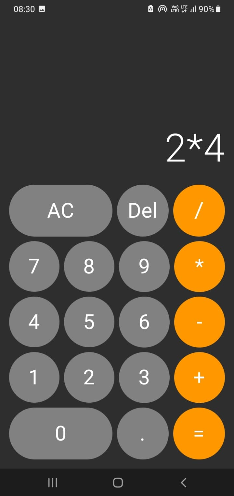

# 📱 Calculator App

A simple and intuitive Android calculator built with Kotlin. This app allows users to perform basic arithmetic operations with a clean and minimal interface.

---

## 🚀 Features

- Basic arithmetic operations: Addition, Subtraction, Multiplication, Division  
- Real-time calculation display  
- Lightweight and responsive UI  
- Clean architecture and codebase    
- Dark and Light theme support

---

## 🛠️ Tech Stack

- **Language:** Kotlin  
- **Build System:** Gradle (Kotlin DSL)  
- **IDE:** Android Studio  
- **Minimum SDK:** 30+ 
- **UI Framework:** Jetpack Compose 

---

## 📦 Getting Started

### 1. Clone the Repository

```bash
git clone https://github.com/happyabhinavmaurya/ComposeCalculator.git
cd ComposeCalculator
```

### 2. Open in Android Studio
Open Android Studio

Click "Open" and select the Calculator project folder

### 3. Build & Run
Connect an Android device or start an emulator

Press Run ▶️ to build and launch the app

## 🧪 Testing
Manual testing on real devices and emulators

## 📸 Screenshots
  
  

## 🤝 Contributing
Contributions are welcome!

Fork the repository

Create a new branch (git checkout -b feature/YourFeature)

Commit your changes (git commit -am 'Add some feature')

Push to the branch (git push origin feature/YourFeature)

Open a pull request

## 📄 License
This project is licensed under the MIT License.
Feel free to use and modify it as per the license terms.

## 🙌 Acknowledgements
Thanks to the open-source Android community for guidance and resources that helped shape this app.

Made with ❤️ using Kotlin and Android Studio.
